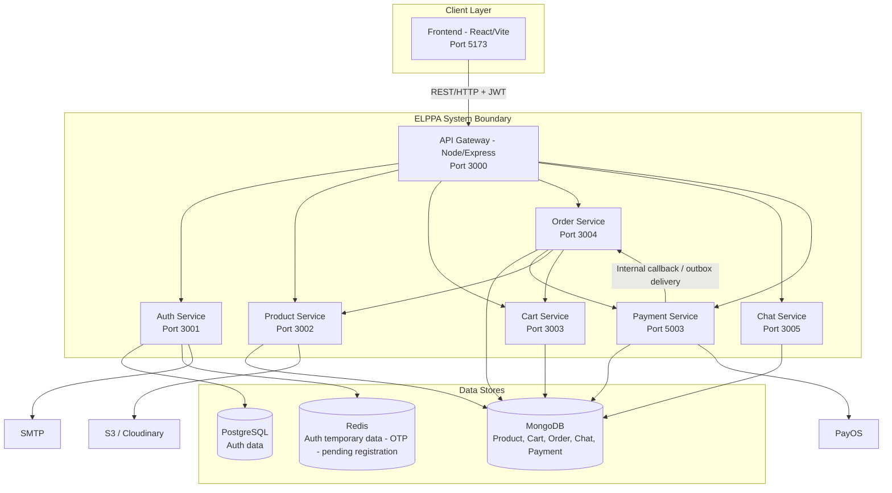

# C4 Diagrams - ELPPA E-Commerce Microservices

## 1. C4 Context Diagram

```mermaid
flowchart LR
    Customer[Customer / End User]
    Admin[Admin]

    ELPPA[(ELPPA E-Commerce System)]

    PayOS[PayOS Payment Gateway]
    SMTP[SMTP Email Service]
    S3[Cloud Storage (AWS S3 / Cloudinary)]

    Customer -->|Browse products, cart, checkout, track orders, chat| ELPPA
    Admin -->|Manage products, categories, orders, users, support chat| ELPPA

    ELPPA -->|Create payment link, verify payment status, receive webhook flow| PayOS
    ELPPA -->|Send OTP / notifications / account email| SMTP
    ELPPA -->|Upload and retrieve product images| S3
```

## 2. C4 Container Diagram



## Notes for defense

- The project implements an API Gateway pattern with domain microservices.
- Communication is primarily synchronous HTTP via the gateway, plus internal callback/event-like flow between Payment and Order (outbox/retry behavior in payment service).
- The current deployment target is Docker Compose local environment; cloud/k8s containers can be mapped from this container diagram.
